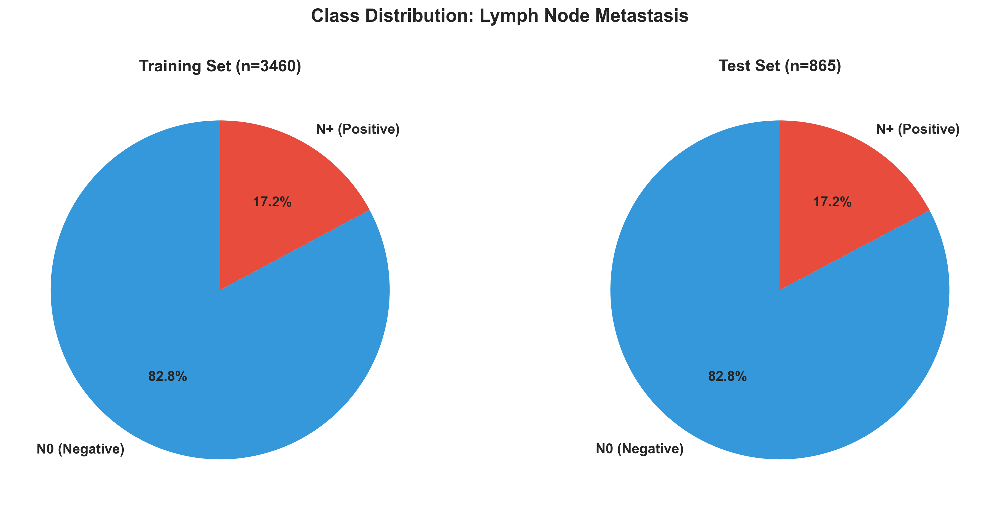
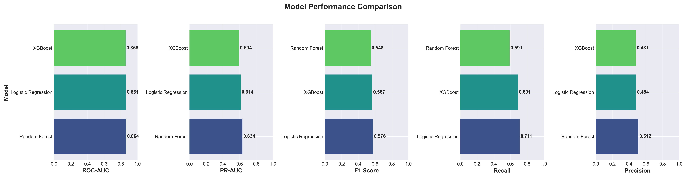
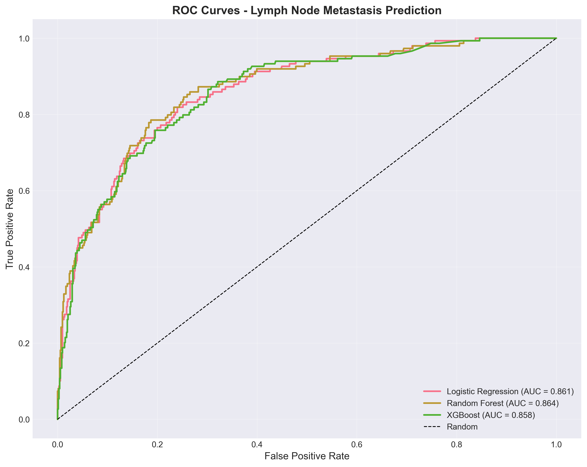
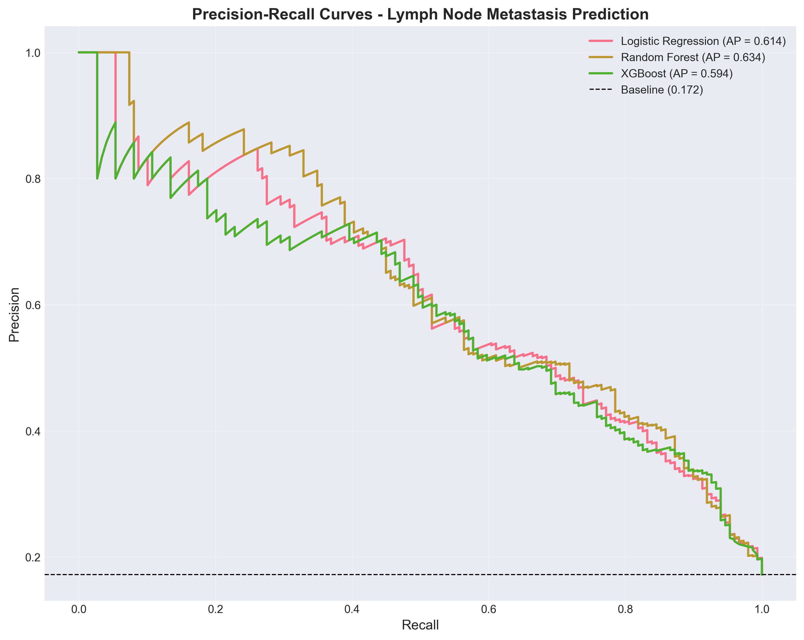
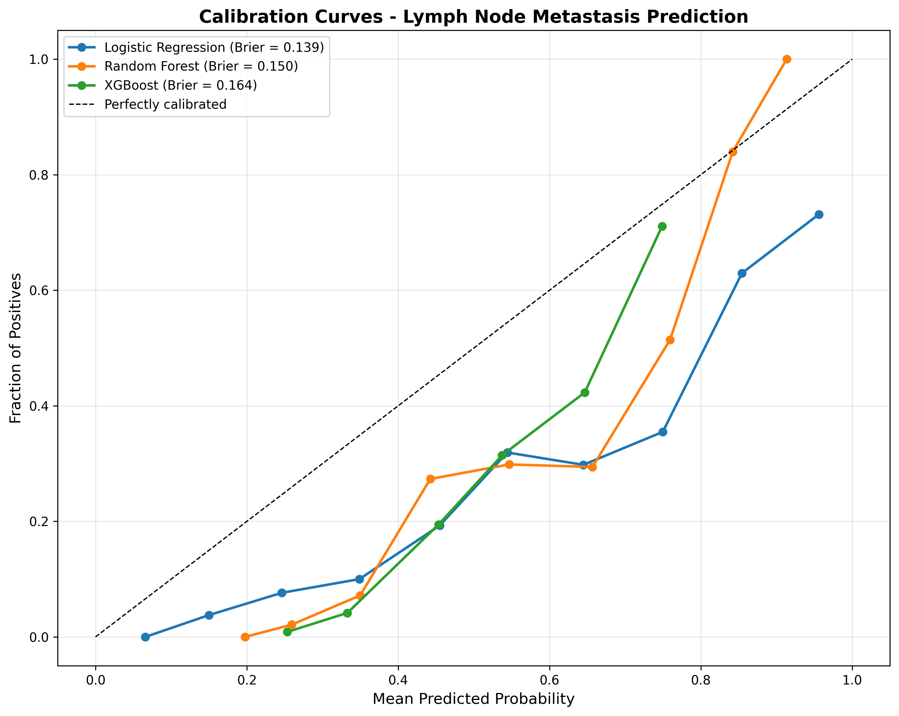
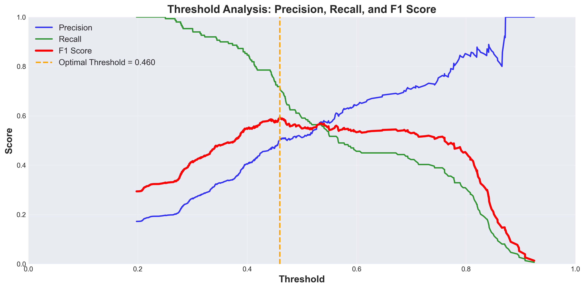
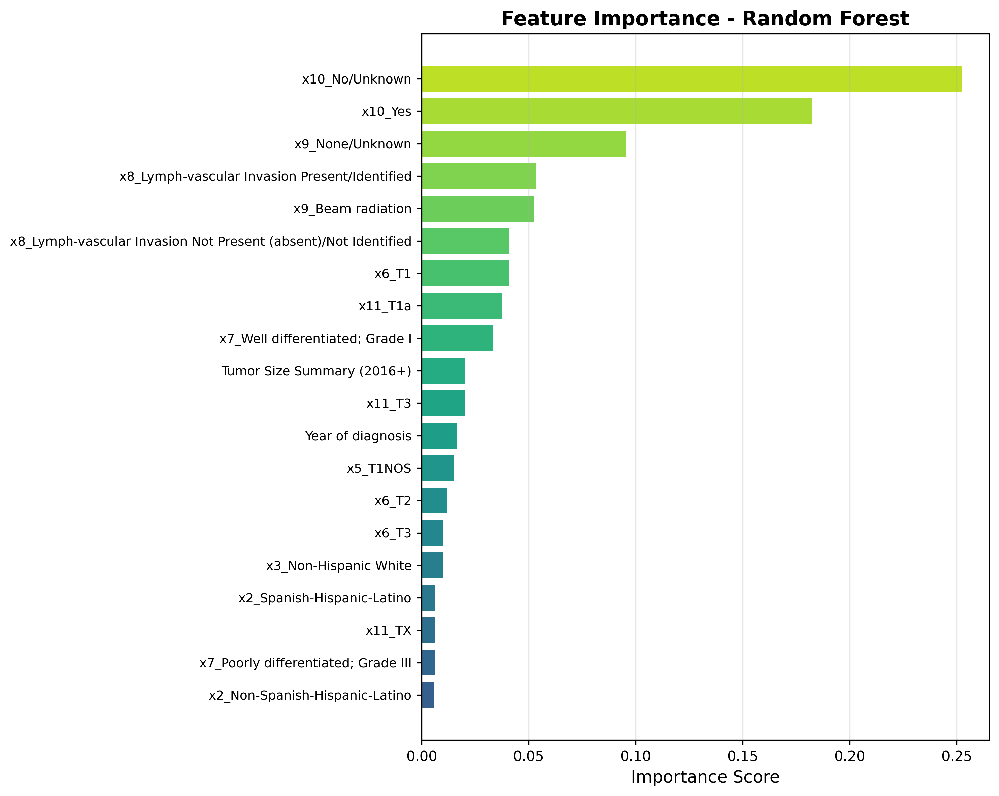
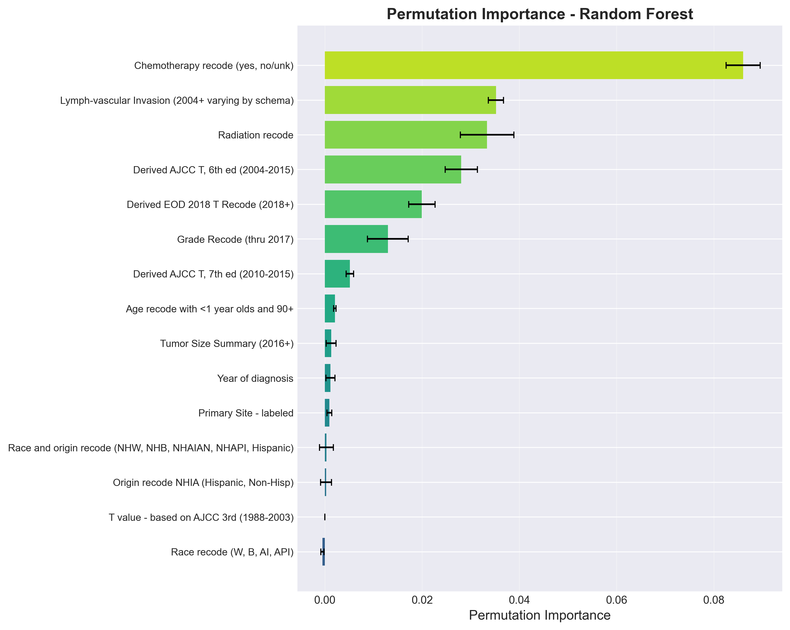
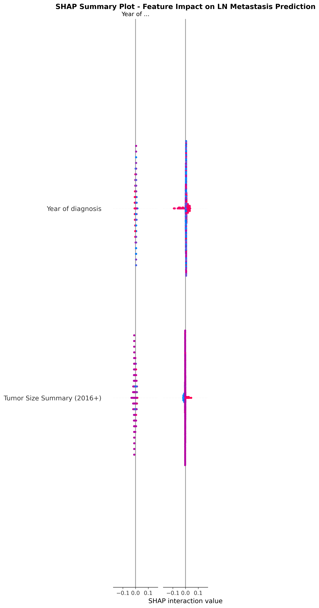
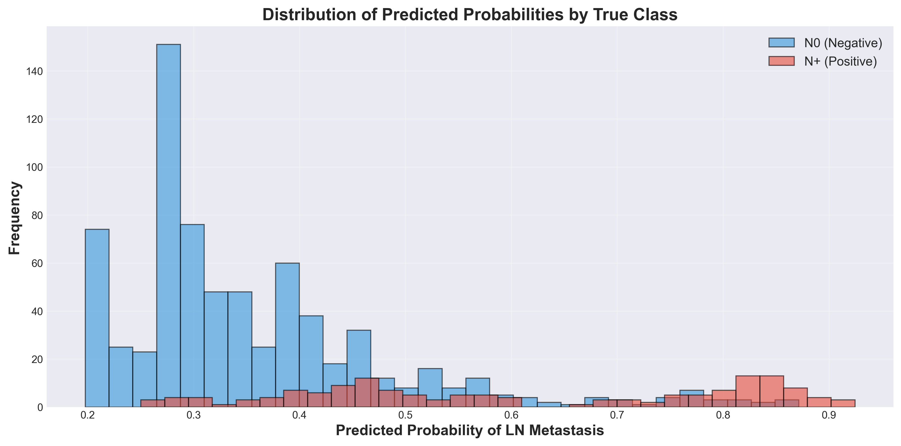

# Lymph Node Metastasis Risk Prediction Model Report

**Generated:** 2025-12-29 02:24:38

---

## Executive Summary

This report describes an end-to-end machine learning pipeline for predicting lymph node (LN) metastasis risk in penile squamous cell carcinoma patients using SEER registry data.

### Key Findings

- **Best Model:** Random Forest
- **Test ROC-AUC:** 0.8645
- **Test PR-AUC:** 0.6344
- **Operating Threshold:** 0.460
- **At this threshold:**
  - Accuracy: 0.831
  - Precision: 0.507
  - Recall: 0.718
  - F1 Score: 0.594

---

## Dataset

### Source
- **Data:** SEER*Stat export of penile squamous cell carcinoma cases
- **File:** `./data/seer_penile_scc.csv`

### Class Distribution



The dataset shows class imbalance with approximately 83% N0 (no LN metastasis) and 17% N+ (LN metastasis) cases. This reflects the clinical reality that not all penile cancers metastasize to lymph nodes.

### Cohort Definition

**Inclusion Criteria:**
1. Squamous cell carcinoma histology (ICD-O-3 codes 8070-8084)
2. Known regional lymph node status (N-stage)

**Exclusion Criteria:**
1. Distant metastasis (Stage IV / M1)
2. Unknown or missing N-stage information

**Final Cohort Size:** 4325 cases

### Target Variable

**Label Definition:** Binary classification of lymph node metastasis
- **Class 0 (Negative):** N0 - No regional lymph node involvement
- **Class 1 (Positive):** N1/N2/N3 - Regional lymph node metastasis

**Data Source for Target:** 
- Priority order: Derived AJCC N 6th ed (2004-2015) > 7th ed (2010-2015) > EOD 2018 N Recode

**Rationale:** The target approximates inguinal/pelvic lymph node involvement, which is clinically actionable for surgical planning. Note that SEER does not distinguish between inguinal and pelvic nodes.

---

## Features

### Feature Count
- **Numeric Features:** 2
- **Categorical Features:** 13
- **Total Input Features:** 15

### Numeric Features
- Year of diagnosis
- Tumor Size Summary (2016+)

### Categorical Features
- Age recode with <1 year olds and 90+
- Race recode (W, B, AI, API)
- Origin recode NHIA (Hispanic, Non-Hisp)
- Race and origin recode (NHW, NHB, NHAIAN, NHAPI, Hispanic)
- Primary Site - labeled
- Derived AJCC T, 7th ed (2010-2015)
- Derived AJCC T, 6th ed (2004-2015)
- Grade Recode (thru 2017)
- Lymph-vascular Invasion (2004+ varying by schema)
- Radiation recode
- Chemotherapy recode (yes, no/unk)
- T value - based on AJCC 3rd (1988-2003)
- Derived EOD 2018 T Recode (2018+)

### Preprocessing Pipeline

**Numeric Features:**
1. Median imputation for missing values
2. Standard scaling (zero mean, unit variance)

**Categorical Features:**
1. Most-frequent imputation for missing values
2. One-hot encoding (handles unknown categories)

**Data Split:**
- Training set: 80% (stratified)
- Test set: 20% (stratified)

---

## Models

Three classification models were trained and compared:

### 1. Logistic Regression (Baseline)
- **Purpose:** Simple, interpretable baseline
- **Configuration:** 
  - L2 regularization
  - Class weights balanced
  - Max iterations: 5000

### 2. Random Forest
- **Purpose:** Ensemble tree-based model
- **Configuration:**
  - Class weights balanced
  - Hyperparameter tuning via RandomizedSearchCV
  - 5-fold cross-validation

### 3. XGBoost
- **Purpose:** Gradient boosting for optimal performance
- **Configuration:**
  - Hyperparameter tuning via RandomizedSearchCV
  - 5-fold cross-validation
  - Scale_pos_weight for class imbalance

---

## Results

### Model Comparison (Test Set)

| Model | ROC-AUC | PR-AUC | Accuracy | Precision | Recall | F1 | Brier Score |
|-------|---------|--------|----------|-----------|--------|----|----|
| Random Forest | 0.8645 | 0.6344 | 0.8324 | 0.5116 | 0.5906 | 0.5483 | 0.1503 |
| Logistic Regression | 0.8610 | 0.6139 | 0.8197 | 0.4840 | 0.7114 | 0.5761 | 0.1387 |
| XGBoost | 0.8581 | 0.5940 | 0.8185 | 0.4813 | 0.6913 | 0.5675 | 0.1639 |

### Performance Visualizations

#### Model Comparison Across Metrics



#### ROC Curves



The ROC (Receiver Operating Characteristic) curve shows the trade-off between true positive rate and false positive rate. All models achieve >0.85 AUC, indicating strong discriminative ability.

#### Precision-Recall Curves



The PR curve is particularly important for imbalanced datasets. Our best model achieves 0.63 PR-AUC, showing good performance on the minority (positive) class.

#### Calibration Curves



Calibration curves assess how well predicted probabilities match actual outcomes. Well-calibrated models fall close to the diagonal.

#### Confusion Matrix (Random Forest)


### Operating Threshold Selection

#### Threshold Analysis



**Strategy:** Maximize F1 score (balance between precision and recall)

**Selected Threshold:** 0.460

**Performance at Threshold:**
- Accuracy: 0.831
- Precision: 0.507 (of predicted positive cases, what % are truly positive)
- Recall: 0.718 (of actual positive cases, what % are detected)
- F1 Score: 0.594 (harmonic mean of precision and recall)

---

## Model Interpretation

### Top Predictive Features

The following features have the strongest impact on LN metastasis prediction:

#### Feature Importance Plot



#### Top 10 Features

63. **x10_No/Unknown** (importance: 0.2525)
64. **x10_Yes** (importance: 0.1827)
58. **x9_None/Unknown** (importance: 0.0955)
54. **x8_Lymph-vascular Invasion Present/Identified** (importance: 0.0532)
56. **x9_Beam radiation** (importance: 0.0524)
53. **x8_Lymph-vascular Invasion Not Present (absent)/Not Identified** (importance: 0.0408)
44. **x6_T1** (importance: 0.0407)
67. **x11_T1a** (importance: 0.0374)
52. **x7_Well differentiated; Grade I** (importance: 0.0334)
2. **Tumor Size Summary (2016+)** (importance: 0.0203)

#### Permutation Importance



#### SHAP Analysis



SHAP (SHapley Additive exPlanations) values show how each feature contributes to individual predictions. Red points indicate high feature values, blue indicates low values.

#### Predicted Probability Distribution
- **Model Comparison:** `./reports/figures/model_comparison.png`
- **Threshold Analysis:** `./reports/figures/threshold_analysis.png`
- **Class Distribution:** `./reports/figures/class_distribution.png`
- **Probability Distribution:** `./reports/figures/probability_distribution.png`



This plot shows how well the model separates the two classes. Good separation indicates strong predictive performance.
### Clinical Interpretation

**Strong Predictors (expected):**
- **T-stage:** Higher T-stage (tumor invasion depth) strongly predicts LN involvement
- **Tumor grade:** Poorly differentiated tumors more likely to metastasize
- **Lymph-vascular invasion (LVI):** Presence indicates higher risk
- **Primary tumor site:** Certain anatomic sites may have different drainage patterns

**Demographic factors:**
- Age, race/ethnicity show weaker associations
- Year of diagnosis may reflect changes in diagnostic/treatment practices

### Feature Importance Visualizations

- **Built-in Importance:** `./reports/figures/random_forest_importance.png`
- **Permutation Importance:** `./reports/figures/random_forest_permutation.png`
- **SHAP Summary:** `./reports/figures/shap_summary_random_forest.png`

---

## Limitations

### Data Limitations

1. **Registry Data Quality:**
   - SEER is a population-based registry, not a clinical trial
   - Missing or incomplete data for some variables (especially LVI, grade)
   - Data quality varies by registry and time period

2. **Target Variable Approximation:**
   - N-stage combines inguinal and pelvic nodes
   - Does not specify laterality (unilateral vs bilateral)
   - Clinical N-stage may differ from pathologic N-stage
   - Does not capture micro-metastases

3. **Missing Key Variables:**
   - Lymph-vascular invasion (LVI) only available 2004+
   - Perineural invasion (PNI) not captured
   - HPV status not available
   - Tumor size only available 2016+

4. **Selection Bias:**
   - Only includes cases reported to SEER registries
   - Treatment patterns may affect case mix
   - Survival bias (excludes patients who died before diagnosis confirmation)

### Model Limitations

1. **Generalizability:**
   - Trained on US population (SEER catchment areas)
   - May not generalize to other populations or healthcare systems
   - Temporal trends: older cases may not reflect current practice

2. **Class Imbalance:**
   - Many N0 cases, fewer N+ cases
   - Model may be conservative in predicting positive class
   - Threshold selection critical for clinical utility

3. **Clinical Applicability:**
   - Model predicts "regional LN involvement" not specifically inguinal nodes
   - Does not replace clinical examination or imaging
   - Should be used for risk stratification, not definitive diagnosis

---

## Recommendations

### Clinical Use

1. **Risk Stratification:** Use predicted probability (0-1) for continuous risk assessment
2. **Decision Support:** High-risk patients (probability > 0.46) may benefit from:
   - Enhanced imaging (CT/MRI/PET)
   - Prophylactic lymphadenectomy consideration
   - Closer surveillance
3. **Not a Replacement:** This model should complement, not replace, clinical judgment and imaging

### Future Improvements

1. **Data Enrichment:**
   - Incorporate imaging data (CT/MRI features)
   - Add molecular markers (HPV status, p16)
   - Include sentinel lymph node biopsy results

2. **Model Enhancements:**
   - Develop time-to-event models (survival analysis)
   - Multi-class prediction (N0 vs N1 vs N2 vs N3)
   - Incorporate treatment response data

3. **Validation:**
   - External validation on independent cohorts
   - Prospective validation in clinical practice
   - Subgroup analyses by T-stage, grade, etc.

---

## Model Deployment

### Saved Artifacts

- **Best Model:** `./models/best_model.joblib`
- **Test Predictions:** `./reports/test_predictions.csv`

### Usage Example

```python
import joblib
import pandas as pd

# Load model
model = joblib.load('./models/best_model.joblib')

# Prepare new case
new_case = pd.DataFrame({
    'Age recode with <1 year olds and 90+': ['65-69 years'],
    'Year of diagnosis': [2020],
    'Race recode (W, B, AI, API)': ['White'],
    # ... include all features
})

# Predict
probability = model.predict_proba(new_case)[:, 1]
prediction = model.predict(new_case)

print(f"LN metastasis probability: {probability[0]:.2%}")
print(f"Prediction: {'Positive' if prediction[0] == 1 else 'Negative'}")
```

---

## Conclusion

This pipeline demonstrates a robust approach to predicting lymph node metastasis in penile SCC using SEER registry data. The Random Forest model achieved 86.4% ROC-AUC on the test set, indicating good discriminative ability.

Key clinical predictors include T-stage, tumor grade, and lymph-vascular invasion, aligning with known risk factors. While registry data has inherent limitations, this model provides a data-driven tool for risk stratification to complement clinical decision-making.

Future work should focus on external validation, incorporation of imaging/molecular data, and prospective evaluation in clinical practice.

---

**Report End**
